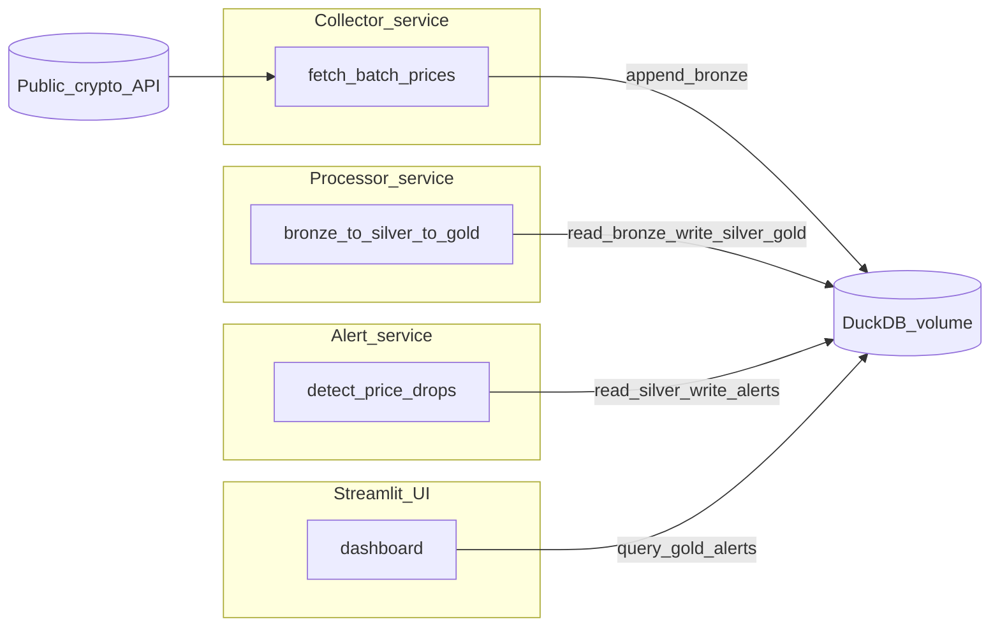

# Crypto Trends Analyzer — Architecture

This document captures the end-state architecture for the `crypto-trends` assignment: a minimal system that regularly fetches crypto prices, stores them in DuckDB, computes trend analytics, and monitors sudden drops with alerts, all runnable locally via Docker.

## Goal mapping (from `TASK.md`)
- **Get data from a public source**: fetch crypto prices from a public API in batches.
- **Collect into a database (not SQLite)**: store in DuckDB warehouse file.
- **Process the data**: compute trend/return/volatility metrics with reproducible transforms.
- **Publish the solution**: a simple local UI (Streamlit) and/or API.
- **Microservice architecture**: separate collection, processing, alerting, and publishing.
- **Testability + documentation**: run locally with Docker; document decisions and runbook.

## Reference patterns you already have in `ceu/`
- **Bronze → Silver → Gold + validations**: `ceu/ds-2/ECBS5294/references/pipeline_patterns_quick_reference.md` and `ceu/ds-2/ECBS5294/notebooks/day3/day3_exercise_mini_pipeline.ipynb`.
- **API ingestion structure** (download + limit + save) pattern: `ceu/ds-2/ECBS5294/scripts/prepare_day3_datasets.py`.
- **Modern Python project setup + start scripts** reference: `ceu/ceu-ai-engineering-class/README.md`.

## Assumptions (defaults)
- **API provider**: CoinGecko (no API key) as default provider; keep an interface so it’s swappable.
- **Alerts destination**: persist alerts in DuckDB and show them in the UI; can extend to webhook/email later.
- **Local-first**: Docker compose runs everything locally; cloud deploy described in README only.

## High-level architecture

## DuckDB warehouse layers (Bronze / Silver / Gold)

### Bronze (append-only archive)
- **Purpose**: preserve raw ingested ticks as received (audit + replay).
- **Table**: `bronze_price_ticks`
- **Key columns** (minimum): `ingested_at`, `provider`, `request_id`, `coin_id`, `symbol`, `currency`, `price`, `asof_ts`, plus any provider fields you want to keep.

### Silver (clean & validated)
- **Purpose**: typed, deduped, analysis-ready facts.
- **Table**: `silver_price_ticks`
- **Uniqueness**: `(provider, coin_id, asof_ts)` must be unique.
- **Validations** (fail fast, `ds-2` style):
  - primary key uniqueness
  - required fields non-null
  - prices non-negative
  - timestamps sane (no far-future beyond small skew)

### Gold (business analytics)
- **Purpose**: dashboard-ready aggregates and signals.
- **Examples**:
  - `gold_latest_prices` (latest tick per coin)
  - `gold_returns` (1h/24h return, rolling volatility)
  - `gold_trends` (moving averages, momentum flags)
  - `gold_market_summary` (top gainers/losers)

### Alerts
- **Table**: `alerts_price_drops`
- **Purpose**: persistence + review/acknowledge flow.
- **Columns**: `coin_id`, `asof_ts`, `drop_pct`, `window`, `threshold`, `status`, `created_at`.

## Services (microservice split)
- **Collector**: fetch batch prices for N selected coins on a schedule; append to bronze.
- **Processor**: build idempotent transforms (silver/gold) using `CREATE OR REPLACE TABLE ...`.
- **Alerter**: detect drop events from silver and write to alerts table.
- **UI (Streamlit)**: read gold + alerts and display trends, movers, and alert history.

## Suggested repo layout (end-state)
- `services/collector/app.py`
- `services/processor/app.py`
- `services/alerter/app.py`
- `services/ui/app.py` (Streamlit entrypoint)
- `packages/common/`
  - `config.py` (env + defaults)
  - `providers/` (CoinGecko client)
  - `db.py` (DuckDB connect + migrations/init)
  - `schemas.py` (row models)
  - `metrics.py` (returns/MA/volatility helpers)
- `docker-compose.yml` orchestrating services + shared DuckDB volume
- `README.md` runbook + “how I’d deploy”

