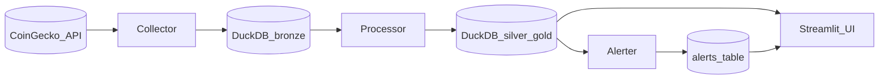

# crypto-trends

A minimal application that follows crypto prices regularly, stores them in **DuckDB** (not SQLite), builds **silver/gold** analytics, monitors **price drops**, and publishes a **Streamlit** dashboard with charts and an architecture diagram.

See `ARCHITECTURE.md` for the full design. Assignment brief: `TASK.md`.

## Architecture (short)



## Services

| Service | Role |
|--------|------|
| **collector** | First run on an **empty** warehouse backfills **~24h** of prices per coin via `market_chart`, then **downsamples to 15-minute buckets** (last price in each window). Later runs append **current** snapshots (`/simple/price`). Optional loop via `COLLECTOR_INTERVAL_SECONDS`. |
| **processor** | Bronze → `silver_price_ticks` → `gold_*` tables (latest, returns, trends, snapshot). |
| **alerter** | Inserts into `alerts_price_drops` when latest tick drops vs prior by ≥ threshold. |
| **ui** | Streamlit app: multi-coin **line charts**, MA7 view, alerts, **Mermaid** architecture tab. |

## DuckDB warehouse

Default path: `data/warehouse.duckdb` (host) or `/data/warehouse.duckdb` (containers).

**Main tables**

- `bronze_price_ticks` — append-only raw ticks  
- `silver_price_ticks` — deduped on `(provider, coin_id, asof_ts)`  
- `gold_latest_prices`, `gold_returns`, `gold_trends`, `gold_market_summary`  
- `alerts_price_drops`  

## Configuration (env)

Shared:

- `DUCKDB_PATH` — path to DuckDB file  
- `COINS` — e.g. `bitcoin:btc,ethereum:eth,solana:sol`  
- `VS_CURRENCY` — default `usd`  

Collector:

- `COLLECTOR_INTERVAL_SECONDS` — if `> 0`, collector loops (default `0` = one shot)  
- `COINGECKO_BASE_URL` — default `https://api.coingecko.com/api/v3`  
- **Initial load (bronze row count = 0)**: uses `GET /coins/{id}/market_chart` with `INITIAL_BACKFILL_DAYS` (default **`1`** ≈ last **24 hours** rolling), then buckets points with **`INITIAL_BACKFILL_INTERVAL_MINUTES`** (default **`15`**). One HTTP call per coin, with a short delay between coins for rate limits.  
- `SKIP_INITIAL_BACKFILL` — if `true` / `1` / `yes`, skip the chart backfill and use `/simple/price` even on first run.  

**Charts show flat zeros?** Delete `data/warehouse.duckdb` (or your `DUCKDB_PATH`) and restart the stack so the collector runs the initial backfill again with the latest code; the Streamlit chart also reads **deduped bronze** if silver is empty, and normalizes timestamps so `st.line_chart` displays non-zero prices reliably.  

Alerter:

- `ALERT_DROP_THRESHOLD_PCT` — e.g. `5` (percent vs **prior tick**)  

## Run locally (Docker Compose)

Requires Docker. From this directory:

```bash
mkdir -p data
docker compose up --build
```

- **Dashboard**: http://localhost:8501  
- Warehouse file on host: `data/warehouse.duckdb`  

Compose runs **collector** on an interval, **processor** and **alerter** in loops, and **Streamlit** bound to `0.0.0.0:8501`.

## Run locally (uv, no Docker)

```bash
mkdir -p data
uv venv
. .venv/bin/activate
uv pip install -r requirements.txt
```

Bootstrap warehouse (one collector run), then process and optionally alert:

```bash
export DUCKDB_PATH=./data/warehouse.duckdb
export COINS="bitcoin:btc,ethereum:eth,solana:sol"
python services/collector/app.py
python services/processor/app.py
python services/alerter/app.py
streamlit run services/ui/app.py --server.port 8501 --server.address 127.0.0.1
```

For a **polling collector** (e.g. every 90s):

```bash
COLLECTOR_INTERVAL_SECONDS=90 python services/collector/app.py
```

## Public deployment (Streamlit)

To make the **dashboard** reachable on the internet, the usual low-friction option is **[Streamlit Community Cloud](https://streamlit.io/cloud)**:

1. Push this repo to GitHub.  
2. Create a new app → point **Main file** to `services/ui/app.py`, Python 3.12+.  
3. Set app **Secrets** / environment variables to match your coins, e.g.  
   `COINS=bitcoin:btc,ethereum:eth` and `DUCKDB_PATH` if you mount storage.  

**Important:** Cloud hosts do not share a persistent disk with your Docker stack. Without extra storage, the UI will still load but historical **DuckDB** charts may be empty until you:

- run the collector elsewhere and **sync** the `.duckdb` file (S3, etc.), or  
- use a **hosted DuckDB** path (e.g. MotherDuck) and point `DUCKDB_PATH` / connection there later, or  
- rely on the app’s **live CoinGecko snapshot** (bar chart) when the warehouse is missing.

For a **single VPS** (DigitalOcean, Hetzner, EC2, etc.), run the same `docker compose up -d` and open port **8501** in the firewall; bind to `0.0.0.0` is already set for Streamlit in Compose and `.streamlit/config.toml`.

## Inspect the warehouse

```bash
duckdb data/warehouse.duckdb "SELECT * FROM silver_price_ticks ORDER BY asof_ts DESC LIMIT 10;"
```

```bash
python -c "import duckdb; con=duckdb.connect('data/warehouse.duckdb'); print(con.execute('select count(*) from bronze_price_ticks').fetchone()[0])"
```

## Rationale (brief)

- **DuckDB**: assignment asks to avoid SQLite; DuckDB is analyst-friendly and matches CEU `ds-2` bronze/silver/gold patterns.  
- **Microservices**: collector / processor / alerter / UI are separate processes (Compose services).  
- **CoinGecko**: public, keyless demo API; client is isolated for swapping providers.  
